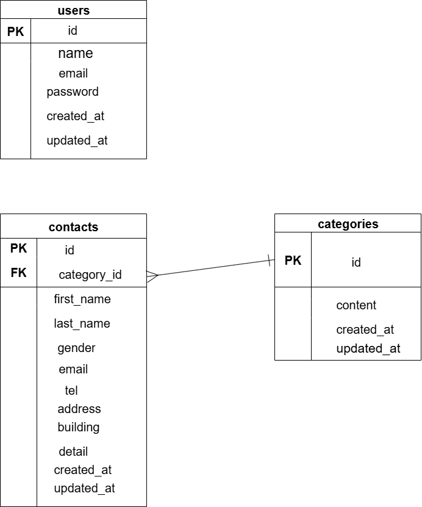

アプリケーション名

# ContactFormApp

環境構築

1.リポジトリをクローンする

# git clone git@github.com:miyu020804/confirm-test.git

2.README 作成

# cd confirm-test

# touch README.md

3.Docker コンテナ起動

# sudo docker-compose up -d

4.PHP コンテナに入る

# sudo docker-compose exec php bash

5.Composer で依存パッケージをインストールする

# composer install

6.環境設定ファイルの作成

# cp .env.example .env

7.アプリケーションキーを作成

# php artisan key:generate

8.マイグレーション実行

# sudo docker-compose exec php php artisan migrate

9.データベースのシーディング

# sudo docker-compose exec php php artisan db:seed

使用技術
・PHP 8.1.33
・Laravel 8.83.8
・Docker 27.5.1
・Docker Compose v2.34.0-desktop.1
・mysql 8.0.26

## ER 図

## URL

開発環境
<http://localhost>

phpMyAdmin
<http://localhost:8080>

※ログイン用ユーザーは/register から作成してください。
